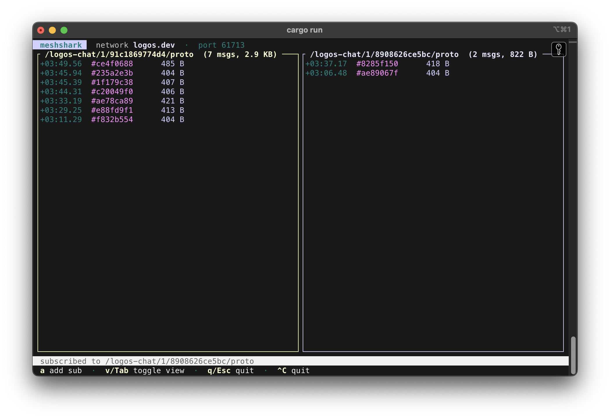

# meshshark




A sniffer for logos-delivery networks. meshshark starts an embedded
logos-delivery node, subscribes to the content topics you ask for, and shows
arriving-message metadata live in a terminal UI — one pane per subscription, or
a single merged stream.

It reports metadata only: arrival time (as a delta from start), a color-coded
content topic, and the payload size. Payload bytes are never inspected, only
measured, and an FNV-1a hash of each payload is used as a message id so you can
spot duplicate deliveries.

## Usage

```
meshshark --sub <ADDRESS|TOPIC> [--sub …] [--all] [--preset …] [--port …]
```

A value passed to `--sub` that starts with `/` is used verbatim as a content
topic; anything else is treated as a delivery address and wrapped as
`/logos-chat/1/<address>/proto`.

```sh
# Watch two delivery addresses
meshshark --sub saro --sub raya

# Watch a full content topic, plus a firehose of everything the node receives
meshshark --sub /logos-chat/1/saro/proto --all
```

You need at least one `--sub` to join a shard and receive anything, even when
using `--all`.

### Options

| Flag | Default | Description |
| --- | --- | --- |
| `-s, --sub <ADDRESS\|TOPIC>` | — | Topic to watch (repeatable). One pane each. |
| `--all` | off | Add a firehose pane showing every message on any content topic. |
| `--preset <NAME>` | `logos.dev` | logos-delivery network preset. |
| `--log-level <LEVEL>` | `ERROR` | Node log level. Kept quiet so it doesn't corrupt the TUI. |
| `--port <PORT>` | OS-assigned | TCP/UDP port for the node. A free port is chosen by default so multiple instances can run side by side. |

## Keys

| Key | Action |
| --- | --- |
| `v` / `Tab` | Toggle between grid and unified views. |
| `a` | Add a subscription at runtime (type an address or topic, `Enter` to confirm, `Esc` to cancel). |
| `q` / `Esc` | Quit. |
| `Ctrl-C` | Quit from any mode. |

## Views

- **Grid** — one pane per subscription, each keeping the last 500 messages.
- **Unified** — a single newest-first merged stream across all subscriptions,
  keeping the last 1000 messages.

## Notes

meshshark links the native logos-delivery node through the `logos-delivery`
crate. Because the embedded Nim/libwaku runtime installs `atexit` handlers that
block on node teardown, meshshark exits via `_exit` rather than a normal
shutdown — the OS reclaims the node at process exit.
