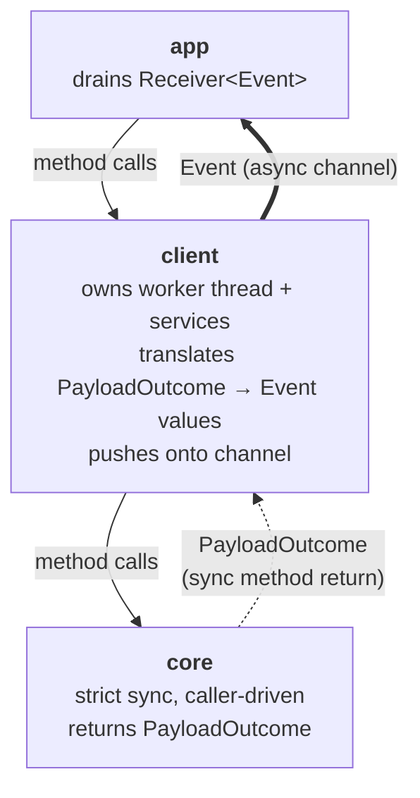
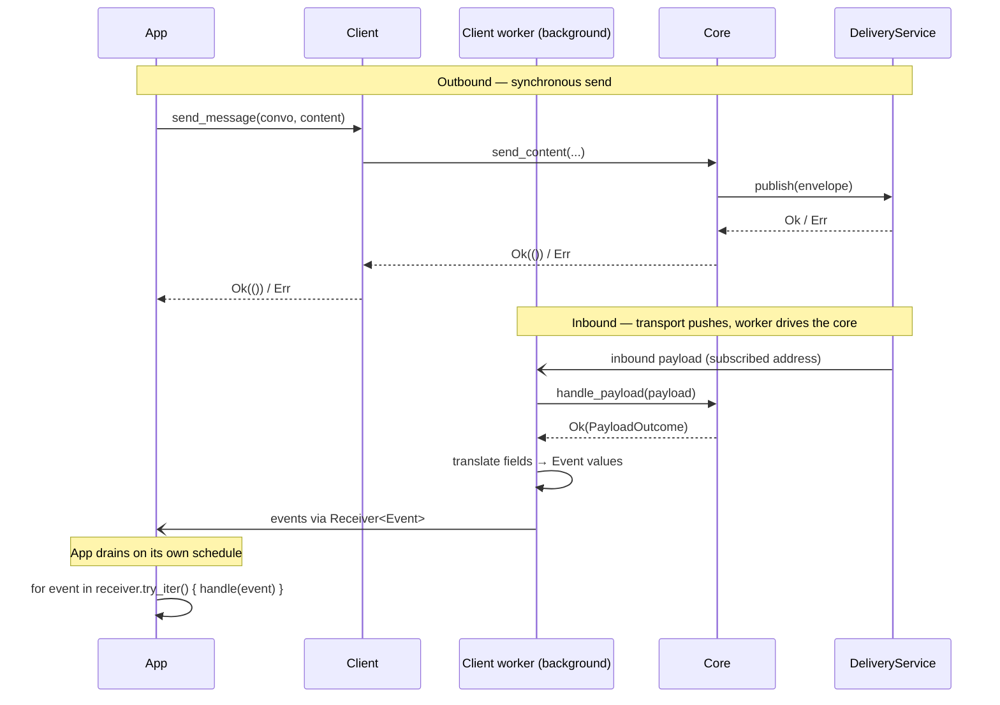

# Client Event System

| Field | Value |
|---|---|
| Status | Accepted |
| Issue | https://github.com/logos-messaging/libchat/issues/97 |
| Date | 2026-05-19 |
| Last revised | 2026-06-11 |

## Context and Problem

Applications must observe several kinds of things produced by the chat library: new conversations appearing from peer-initiated handshakes, decrypted messages on existing conversations, and further protocol observations (group membership changes, reliability signals). These observations are not coupled — an MLS group welcome creates a new conversation with no initial content; a single inbound payload can yield multiple observations; some observations (delivery timeouts from background retry work) have no synchronous trigger at all and must reach the application after the call that might have caused them has long since returned.

Issue #97 captures the requirement for an observation surface that does not piggy-back on content, accommodates both sync-triggered and background-triggered observations uniformly, and crosses the FFI boundary cleanly.

## Decision Drivers

- **Simplicity of the core.** Fully synchronous and caller-driven: no background work, no callbacks out. External effects flow through services injected as method parameters.
- **Asynchronous delivery at the client.** Applications consume events on their own schedule. Observations from sync-triggered processing and observations from background work share a single delivery surface, so the application sees one notification stream and does not care which path produced any given event.
- **FFI compatibility.** Downstream modules wrap the client behind a C API; payloads crossing that boundary are limited to owned, concrete data — no closures, generics, or non-`'static` references — so any delivery mechanism must degrade to a sync drain on that side.

## Architecture

Three layers. Calls flow downward. Sync results return through method returns; events reach the application asynchronously through a channel.

Crates: **app** — `bin/chat-cli`, future `logos-chat-module`; **client** — `crates/client`; **core** — `core/conversations` and friends in libchat.

## Decisions

1. **Core returns `PayloadOutcome`, a dispatcher-level enum.** Each inbound path inside the core yields its own concrete outcome type: `ConvoOutcome` (`Convo::handle_frame`) carries decrypted contents on an existing conversation; `InboxOutcome` (inbox / inbox_v2 handlers) carries a newly observed conversation plus an optional initial `ConvoOutcome`. `PayloadOutcome` is the dispatcher-level union (`Empty`, `Convo(ConvoOutcome)`, `Inbox(InboxOutcome)`) and is the single type `Context::handle_payload` returns; `From<ConvoOutcome>` / `From<InboxOutcome>` impls keep the per-path handlers free of `PayloadOutcome` in their signatures. The split encodes at the type level what each producer can populate — a `Convo` cannot manufacture a new conversation, so its signature precludes the possibility.

2. **`Event` is an asynchronous notification.** The client's constructor returns a `Receiver<Event>` alongside the client handle. A background worker receives inbound payloads pushed from the transport (the Delivery Service's inbound side) — it is never polled — calls into the core for each, translates the resulting `PayloadOutcome` into one event per observation, and pushes them onto the channel. Background work that has no synchronous trigger at all (delivery retry timeouts, future protocol timers) pushes onto the same channel.

3. **Two enums, mapping at the client boundary.** `PayloadOutcome` is the dispatcher-level sum of observations from one payload; `Event` is a discrete app-facing notification. The two enums are allowed to diverge: a protocol-internal observation the app does not need lives only on a core outcome type; a client-only event like `DeliveryFailed { Timeout }` lives only on `Event`. Translation is an explicit per-variant `match` inside the client — not a blanket `From` impl — to preserve that divergence as both sides grow.

4. **`ConversationClass` is a core boundary type, not a client-only one.** The protocol-versioned `ConversationKind` (`PrivateV1`, `GroupV1`, …) is a storage concern; clients only need the coarse class (`Private`, `Group`). The kind→class mapping happens in core where `NewConversation` is constructed, so adding a new `ConversationKind` is a one-line change in core's mapping site rather than a ripple into every client. The client re-exports `ConversationClass` for consumers, but the canonical definition lives in core alongside the outcome types.

## Events vs errors

Events are asynchronous notifications: things the application learns after the call that might have triggered them has returned. They cross thread boundaries through the channel.

Synchronous failures — publish, parse, store, MLS — stay on `Result<_, ChatError>` on the call that triggered them. They are never events. `DeliveryFailed { reason }` is therefore an event by construction: only background work can raise it, after the original send already returned `Ok`.

## Sequence

Two flows cover everything the application observes: a synchronous send initiated by the app, and inbound bytes the transport pushes to the client's worker.

