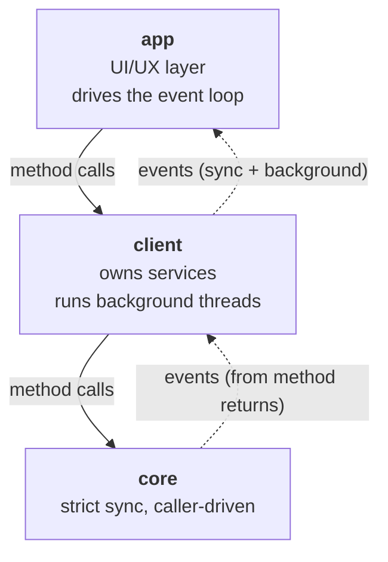
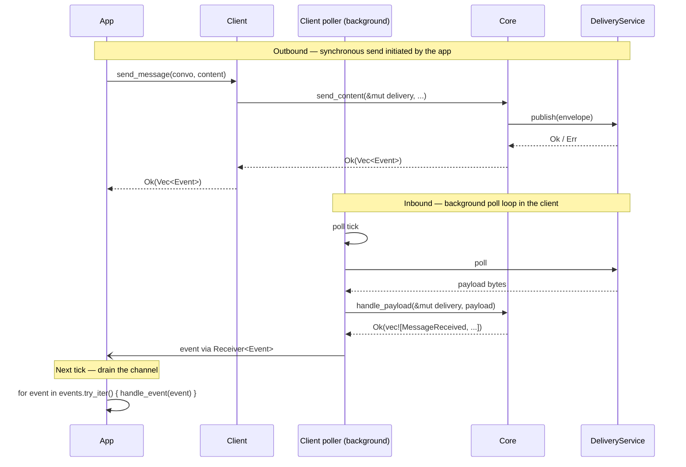

# Client Event System

| Field | Value |
|---|---|
| Status | Accepted |
| Issue | https://github.com/logos-messaging/libchat/issues/97 |
| Date | 2026-05-19 |

## Context and Problem

Applications currently learn about new conversations from an `is_new_convo: bool` flag on `ContentData` (`core/conversations/src/types.rs:16-20`). Two problems:

1. The flag overloads `ContentData`: protocol metadata is smuggled through a content carrier.
2. The flag assumes every new conversation carries an initial content frame. Protocols such as MLS allow a conversation to begin without one; in that case `handle_payload` returns `None` and the application never observes the new conversation.

Issue #97 calls for a proper event system that can signal new conversations, delivery receipts, and reliability failures — without piggy-backing on content — and that provides a clear path for adding new event types later.

This ADR specifies the layered design of the event system and how events reach the application.

## Decision Drivers

- **Simplicity of the core.** Fully synchronous and caller-driven: no background work, no callbacks out. External effects are performed through services injected as method parameters.
- **Extensibility.** A new event type is a localised change (one enum variant, one emit site) that does not break existing consumers.
- **FFI compatibility.** Must remain expressible through the existing `safer-ffi` boundary in `crates/client-ffi`. Event payloads are limited to owned, concrete data (bytes, strings, identifiers) — no closures, generics, or non-`'static` references.

## Architecture

The library is organised in three layers. Calls flow downward; events flow upward.



Crates: **app** — `bin/chat-cli`, future `logos-chat-module`; **client** — `crates/client`, `crates/client-ffi`; **core** — `core/conversations` and friends in libchat.

## Design

### Core layer

#### Constraints

- Strict sync, single-threaded.
- No background work, timers, or internal queues.
- External effects (delivery; future registration / identity lookups) are performed through services injected as method parameters.

#### Approach

Methods receive the services they need and call them directly. Observations (events) are returned so the caller can surface them upward:

```rust
impl<S: ChatStore> Context<S> {
    pub fn handle_payload<D: DeliveryService>(
        &mut self,
        delivery: &mut D,
        payload: &[u8],
    ) -> Result<Vec<Event>, ChatError>;

    pub fn send_content<D: DeliveryService>(
        &mut self,
        delivery: &mut D,
        convo: ConversationId,
        content: &[u8],
    ) -> Result<Vec<Event>, ChatError>;

    pub fn create_private_convo<D: DeliveryService>(
        &mut self,
        delivery: &mut D,
        intro: &Introduction,
        content: &[u8],
    ) -> Result<(ConversationIdOwned, Vec<Event>), ChatError>;
}
```

### Client layer

#### Responsibility split

The client owns the concrete service implementations (delivery, future registration, identity), polls the transport on a background thread, and processes inbound bytes by calling into the core. The application invokes client methods and consumes events; raw transport bytes (encrypted envelopes off the wire) are handled entirely inside the client.

#### Constraints

- Owns the concrete service implementations and injects them into core method calls.
- Events from synchronous calls flow through the method's return type, inherited from the core.
- Polls the transport on a background thread and feeds inbound payloads into the core.
- May spawn additional background threads (e.g. for timer-driven retries).
- Background threads emit events that no caller-invoked method can return — for example `DeliveryFailed { reason: Timeout }`.

#### Common shape (all options)

The client invokes core methods with its services; the core publishes envelopes directly through the injected delivery service. Only events flow back as return values.

```rust
impl<D: DeliveryService> ChatClient<D> {
    pub fn send_message(&mut self, convo: &ConversationIdOwned, content: &[u8])
        -> Result<Vec<Event>, ClientError<D::Error>>;   // sync events from this send

    // Background events (including those from inbound payload processing) reach the
    // application through one of the three mechanisms below.
}
```

The three options differ only in how background events reach the application.

#### Option A — internal poll queue

The client owns a `Mutex<VecDeque<Event>>`. Background threads push to it; the application drains via two new methods.

```rust
impl<D: DeliveryService> ChatClient<D> {
    pub fn poll_event(&mut self) -> Option<Event>;
    pub fn drain_events(&mut self) -> Vec<Event>;
}
```

Prior art: mio's `Events` (per-`Poll` instance, drained by the caller); rdkafka's `Consumer::poll` (background thread fills a queue, caller polls — same domain).

**Pros**

- Single primitive (mutex-protected queue) with no new dependencies.
- FFI mapping is direct: `client_poll_event` returns an opaque `Option<Event>`, mirroring the existing `PushInboundResult` shape (`crates/client-ffi/src/api.rs:49-55`).
- Matches the existing chat-cli tick-loop consumer pattern (`bin/chat-cli/src/app.rs:144-180`).

**Cons**

- Requires the application to drain after every operation; events accumulate if it forgets.
- Adds shared mutable state (`Mutex<VecDeque>`) inside the client; the queue must be bounded with explicit overflow handling.

#### Option B — channel handed to the caller (selected)

The client's constructor returns a `Receiver<Event>` alongside the client handle. Background threads hold a `Sender<Event>` clone; the application reads from the receiver.

```rust
let (client, events): (ChatClient<_>, Receiver<Event>) =
    ChatClient::new(name, delivery);
```

Prior art: most Rust networking libraries; `std::sync::mpsc`, `crossbeam-channel`, `flume`.

**Pros**

- Channels are the canonical multi-producer/single-consumer primitive in the standard library; the shape is idiomatic in pure Rust.
- The application can park in `recv()` from a worker thread, integrate with `select!`, or later swap to `tokio::sync::mpsc` for an async wrapper.
- Mirrors the inbound-bytes channel chat-cli already uses (`bin/chat-cli/src/app.rs:46`).

**Cons**

- `Receiver<T>` is not `#[repr(C)]` and cannot cross `safer-ffi` cleanly. The FFI layer must expose a drain function regardless, collapsing Option B into Option A at the boundary.
- Forces a channel-crate choice (`std::sync::mpsc`, `crossbeam-channel`, or `flume`).

#### Option C — callback registered at construction

The application registers a closure at construction; background threads invoke it directly when events arise.

```rust
type EventFn = Box<dyn Fn(&Event) + Send + 'static>;

impl ChatClient<D> {
    pub fn new(name: &str, delivery: D, on_event: EventFn) -> Self;
}
```

Prior art: the existing FFI `DeliverFn` callback at `client_create` (`crates/client-ffi/src/delivery.rs:8-15`); `tracing::Subscriber`; GTK signals.

**Pros**

- The codebase already establishes this pattern for outbound delivery; events would extend a familiar contract.
- FFI mapping is direct: register an `EventFn` function pointer at `client_create`.
- No internal queue or `Mutex` to maintain.

**Cons**

- The callback fires on the background thread. UI-style consumers (ratatui, GUI toolkits) cannot update state from threads other than the main loop thread and will bridge the callback into a thread-local queue — effectively re-implementing Option A in user code.
- The closure must be `Send + 'static`; capturing application state requires `Arc<Mutex<…>>` or a channel back to the application.
- Sync events arrive on the caller's thread; background events arrive on the background thread. The handler must be correct in both threading contexts, or the callback must forward to the main thread (collapsing into Option A).

#### Comparison

| Criterion | A: poll queue | B: channel | C: callback |
|---|---|---|---|
| Background events delivered via | `poll_event` / `drain_events` | `Receiver<Event>` | direct `Fn(&Event)` invocation |
| FFI fit (`safer-ffi`) | Native opaque + accessors | Degrades to Option A at the boundary | Native function pointer (matches `DeliverFn`) |
| New dependencies | None | None (with `std::sync::mpsc`); otherwise `crossbeam-channel` or `flume` | None |
| Internal state required | `Mutex<VecDeque<Event>>` | Channel internals | None |
| Thread on which the application observes the event | Application thread (next drain) | Application thread (next drain) | Background thread |
| Bridges naturally to UI thread | Yes | Yes | No (requires re-bridging) |
| Backpressure if the application is slow | Client-side queue buffers; bounded with overflow handling | Channel buffers; bound configurable | No buffer; slow callbacks block the background thread |
| Future `Stream` adapter | Wrap `poll_event` in a `Stream` | Swap to async channel (native) | Bridge callback into a channel, then `Stream` |

### App layer

The application drives the event loop. With Option B (selected), each tick drains the `Receiver<Event>` handed back at client construction:

```rust
pub fn tick(&mut self) -> Result<()> {
    for event in self.events.try_iter() {
        self.handle_event(event);
    }
    Ok(())
}
```

For reference, Option A would replace `self.events.try_iter()` with `self.client.drain_events()`. Option C moves the drain out of the tick — into the callback — and the callback typically forwards into an application-side channel that is drained on each tick anyway.

## Event Taxonomy

The same `Event` enum is shared across all three client options.

```rust
#[derive(Debug, Clone)]
#[non_exhaustive]
pub enum Event {
    #[non_exhaustive]
    ConversationStarted {
        conversation_id: ConversationIdOwned,
    },
    #[non_exhaustive]
    MessageReceived {
        conversation_id: ConversationIdOwned,
        data: Vec<u8>,
    },
    #[non_exhaustive]
    DeliveryReceipt {
        conversation_id: ConversationIdOwned,
        envelope_id: EnvelopeId,
    },
    #[non_exhaustive]
    DeliveryFailed {
        conversation_id: ConversationIdOwned,
        envelope_id: EnvelopeId,
        reason: FailureReason,
    },
}

#[derive(Debug, Clone)]
#[non_exhaustive]
pub enum FailureReason {
    Transport,    // synchronous transport error on publish
    PeerRejected, // peer signalled rejection (future protocol work)
    Timeout,      // no receipt within the retry window
}
```

`#[non_exhaustive]` on the enum permits new variants; on each struct variant it permits new fields. Both are additive minor-release changes. Future variants (`ConversationRekeyed`, `ParticipantJoined`, `PresenceChanged`, transport health, key-rotation reminders, …) follow this rule.

Mapping of variants to emit sites:

| Variant | Emitted from |
|---|---|
| `ConversationStarted` (responder side) | `core/conversations/src/inbox/handler.rs:155-162` (replaces `is_new_convo: true`) |
| `MessageReceived` | `core/conversations/src/conversation/privatev1.rs:184-191` (replaces `is_new_convo: false`) |
| `DeliveryReceipt` | `Context::handle_payload` when decoding a `PrivateV1Frame::Receipt` (future protocol work) |
| `DeliveryFailed { Transport }` | Core method that invoked `delivery.publish` and observed a synchronous error |
| `DeliveryFailed { Timeout }` | Client's background retry thread |

Events are the uniform observation channel: they carry both observations the call itself caused (e.g. a sync `DeliveryFailed { Transport }` from `send_content`) and observations from background work (e.g. `DeliveryFailed { Timeout }` from the retry thread). The only thing kept outside `Vec<Event>` is an obvious primary result the caller will use immediately — returned directly for ergonomics. This is why the initiator side does not emit `ConversationStarted`: `create_private_convo` returns the new `ConversationIdOwned` directly as part of its return value.

## Decisions

1. **Sync at the client layer for now.** The core stays sync; the client also stays sync. Migrating to async later is non-structural — `std::sync::mpsc::Receiver<Event>` swaps to `tokio::sync::mpsc::Receiver<Event>` and gains an `impl Stream` shape without changing the chosen mechanism (point 2). Option A would migrate to a `Stream` over a notify primitive; Option C to an `async fn` callback.

2. **Consumer pattern: Option B — channel handed to the caller.** Different consumer archetypes could favour different shapes — a polling UI loop suits Option A; a low-latency push-driven consumer (toast notifications, daemons) suits Option C — but Option B is preferred: it is the most Rust-idiomatic of the three, has few drawbacks compared to A or C, and offers the smoothest path to async (point 1).

## Event flow

A worked example of the decisions above. Two flows cover everything the application observes: a synchronous send initiated by the app, and a background inbound carried by the client's transport poller.



## References

### Source references

- `core/conversations/src/types.rs:9-20` — current `ContentData` and `AddressedEnvelope`
- `core/conversations/src/context.rs:138-185` — `Context::handle_payload` (core inbound entry)
- `core/conversations/src/inbox/handler.rs:124-167` — inbox handshake handler (current `is_new_convo` set site)
- `core/conversations/src/conversation/privatev1.rs:184-191, 219-260` — private-conversation handler
- `crates/client/src/client.rs:60-92` — `ChatClient` public surface
- `crates/client/src/delivery.rs` — `DeliveryService` trait
- `crates/client-ffi/src/api.rs:49-55, 220-285` — current FFI inbound result shape
- `crates/client-ffi/src/delivery.rs:8-15` — existing FFI callback pattern (`DeliverFn`)
- `bin/chat-cli/src/app.rs:46, 144-180` — current application consumption pattern
