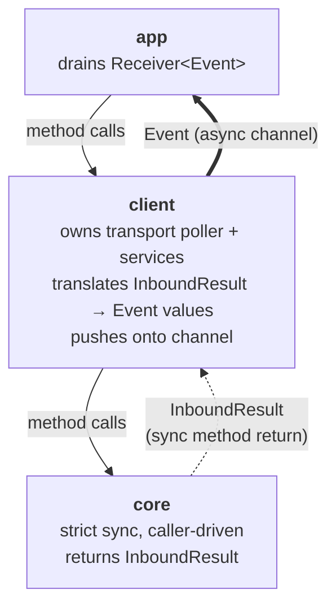
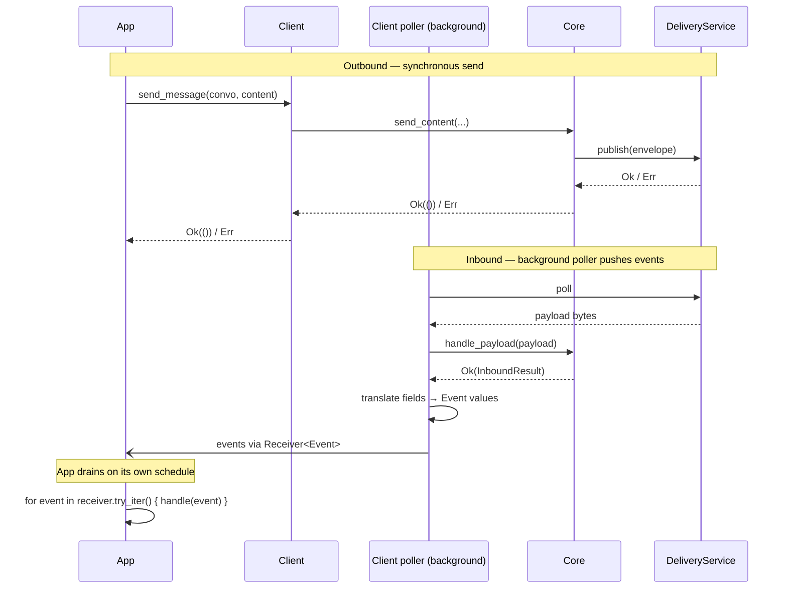

# Client Event System

| Field | Value |
|---|---|
| Status | Accepted |
| Issue | https://github.com/logos-messaging/libchat/issues/97 |
| Date | 2026-05-19 |
| Last revised | 2026-05-25 |

## Context and Problem

Applications must observe several kinds of things produced by the chat library: new conversations appearing from peer-initiated handshakes, decrypted messages on existing conversations, and further protocol observations (group membership changes, reliability signals). These observations are not coupled — an MLS group welcome creates a new conversation with no initial content; a single inbound payload can yield multiple observations; some observations (delivery timeouts from background retry work) have no synchronous trigger at all and must reach the application after the call that might have caused them has long since returned.

Issue #97 captures the requirement for an observation surface that does not piggy-back on content, accommodates both sync-triggered and background-triggered observations uniformly, and crosses the FFI boundary cleanly.

## Decision Drivers

- **Simplicity of the core.** Fully synchronous and caller-driven: no background work, no callbacks out. External effects flow through services injected as method parameters.
- **Asynchronous delivery at the client.** Applications consume events on their own schedule. Observations from sync-triggered processing and observations from background work share a single delivery surface, so the application sees one notification stream and does not care which path produced any given event.
- **FFI compatibility.** Payloads crossing the `safer-ffi` boundary in `crates/client-ffi` are limited to owned, concrete data — no closures, generics, or non-`'static` references — so any delivery mechanism must degrade to a sync drain on that side.

## Architecture

Three layers. Calls flow downward. Sync results return through method returns; events reach the application asynchronously through a channel.

Crates: **app** — `bin/chat-cli`, future `logos-chat-module`; **client** — `crates/client`, `crates/client-ffi`; **core** — `core/conversations` and friends in libchat.

## Decisions

1. **Core returns `InboundResult`, a structural result type.** One field per kind of observation a payload can produce: an optional new conversation, plus a `FrameOutcome` carrying everything a per-conversation frame processor yields. The structural shape encodes causality (a new conversation is logically prior to anything that happens inside it), so a wrong ordering of observations cannot be represented in the type. `FrameOutcome` exists as a separate type because `Convo::handle_frame` cannot create a conversation; embedding it inside `InboundResult` keeps each return type producing only what its source can populate.

2. **`Event` is an asynchronous notification.** The client's constructor returns a `Receiver<Event>` alongside the client handle. A background poller drives the transport, calls into the core for each inbound payload, translates the resulting `InboundResult` into one event per observation, and pushes them onto the channel. Background work that has no synchronous trigger at all (delivery retry timeouts, future protocol timers) pushes onto the same channel.

3. **Two enums, mapping at the client boundary.** `InboundResult` is the structural sum of observations from one payload; `Event` is a discrete app-facing notification. The two enums are allowed to diverge: a protocol-internal observation the app does not need lives only on `FrameOutcome`; a client-only event like `DeliveryFailed { Timeout }` lives only on `Event`. Translation is an explicit per-variant `match` inside the client — not a blanket `From` impl — to preserve that divergence as both sides grow.

## Events vs errors

Events are asynchronous notifications: things the application learns after the call that might have triggered them has returned. They cross thread boundaries through the channel.

Synchronous failures — publish, parse, store, MLS — stay on `Result<_, ChatError>` on the call that triggered them. They are never events. `DeliveryFailed { reason }` is therefore an event by construction: only background work can raise it, after the original send already returned `Ok`.

## Sequence

Two flows cover everything the application observes: a synchronous send initiated by the app, and inbound bytes carried by the client's transport poller.

