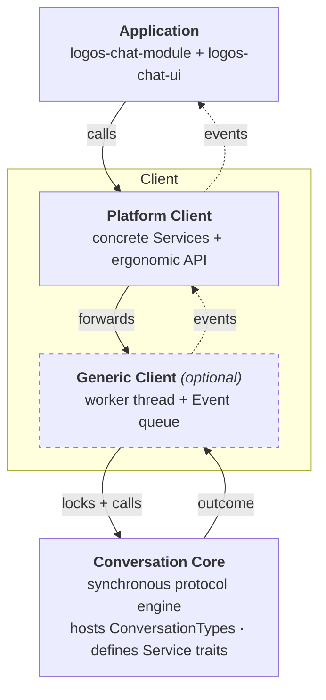
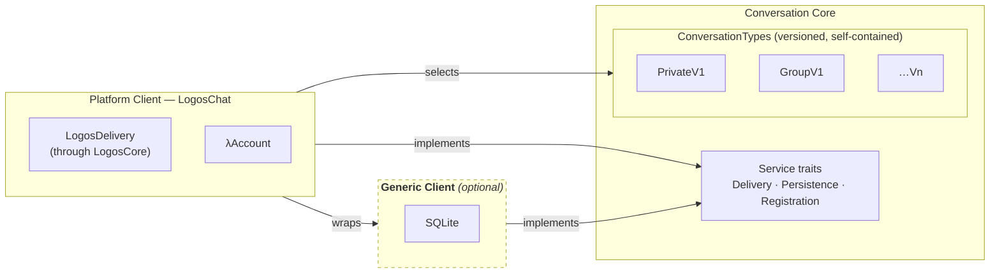
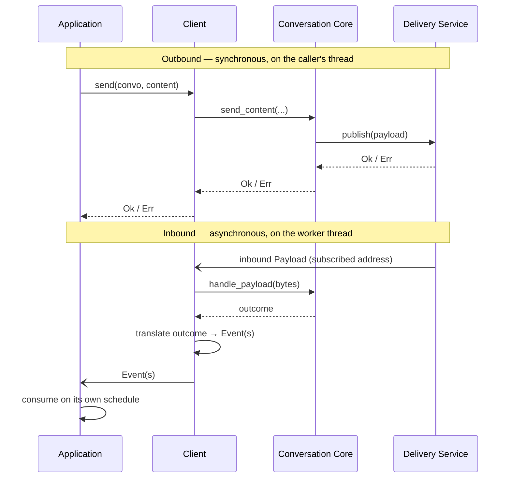

# Target Architecture

> **Status:** Proposed — for alignment · **Last revised:** 2026-06-08

This document describes the **target architecture** for the chat stack: the role each
layer plays and the boundaries between them. It is a normative reference for design
discussions and reviews — a shared picture of the shape we are building toward, not a
description of any current implementation.

Terminology follows the [chat specifications](https://github.com/logos-messaging/specs)
(`chatdefs`, `chat-framework`, `privatev1`).

## Vocabulary

| Term | Meaning |
|---|---|
| **Content** | Opaque application bytes whose meaning is defined solely by the Application (which may structure them with an envelope such as a ContentFrame). The Core never inspects Content. |
| **Frame** | A structured protocol message exchanged between Clients. |
| **Payload** | The serialized binary form of a Frame; opaque to the transport. |
| **Conversation** | One instance of a chat protocol between participants; owns protocol operations (encryption, reliability, segmentation). |
| **ConversationType** | A versioned protocol implementation (`PrivateV1`, `GroupV1`, …). Self-contained: defines its own Frame types and storage needs. |
| **Delivery Service (DS)** | The transport boundary, both directions: accepts outbound Payloads by delivery address and delivers inbound Payloads to the subscribers of an address. |
| **Service** | An external effect the Core needs but does not implement — delivery, persistence, registration/identity. The Core defines it as a trait; an outer layer supplies the implementation. |
| **Event** | An asynchronous notification of something the Application could not learn as a return value: an inbound observation (message received, conversation started) or a deferred outcome (delivery acknowledged or timed out).
| **Client** | The component that manages Conversations and exposes messaging to Applications. |
| **Application** | Software that integrates a Client to send and receive Content. |

## Layers

Four responsibilities stack from the protocol engine up to the product. Dependencies
point downward: each layer knows only about the layer beneath it.

Solid arrows are synchronous — a call going down and its result coming back on the same
call; the Conversation Core hands its outcome straight back to its caller.
Dotted arrows carry Events asynchronously: the Generic Client fills a queue, which the
Platform Client adapts into the surface the Application consumes. The Application depends
only on the Platform Client, in both directions — it calls the Platform Client and consumes
the Event surface the Platform Client exposes. The **Generic Client** and **Platform
Client** are the two roles of the single *Client* the specs name, shown as the outer box —
a reusable runtime mechanism, and a concrete binding over it. The Generic Client is
**optional** (dashed border): a platform without OS threads omits it, and the Platform
Client drives the Core directly — see [Runtime independence](#runtime-independence).

### Responsibilities

| Layer | Role & owns | Execution model | Must not | Example | Repo |
|---|---|---|---|---|---|
| **Conversation Core** | The protocol engine. Hosts pluggable ConversationTypes, defines the Service trait contracts, routes an inbound Payload to the right Conversation, returns a structured outcome. | Strictly synchronous and caller-driven; runs on the caller's thread. | Spawn threads · do background work · call out via callbacks · depend on a runtime or transport. | `Core` + `PrivateV1` / `GroupV1` | `libchat` |
| **Generic Client** *(optional)* | The native runtime the Core lacks, **batteries included**: an OS worker that drives inbound processing, the Event queue, lifecycle/shutdown — **plus portable default Service implementations** (in-memory, SQLite) so a native app works out of the box. Parameterized over the Service traits. | Owns the worker thread and the Event queue (a buffer it fills). Outbound calls run on the caller's thread. | Call outward into its consumer · depend on an async runtime. | `ChatClient<D, R>` | `libchat` |
| **Platform Client** | The complete app-facing surface for one platform: selects which ConversationTypes to support, wires the platform-specific Services, exposes the easy API, and adapts the Generic Client's Event queue into its app-facing surface (e.g. an async API on Tokio, signals on Qt). | A facade over the Generic Client. It may adopt a platform runtime (e.g. Tokio) to shape its API and bridge the Event queue into it. Where there are no OS threads, it also takes on the runtime role and drives the Core on the host event loop. | Be generic · leak Service type parameters to the Application. | `LogosChatClient` | `logos-chat-module` |
| **Application** | Integrates the Platform Client; drives outbound on user action and renders/acts on the Events it receives. | Owns its own main / UI / async runtime; consumes Events on its own schedule, through the surface the Platform Client exposes. | Touch protocol internals · assume which path or thread produced an Event. | UI views + app glue | `logos-chat-module` + `logos-chat-ui` |

## Governing principles

1. **Simplicity of the core.** The Conversation Core is fully synchronous and
   caller-driven: no background work, no callbacks out. External effects flow through
   Services injected as parameters. This keeps the protocol code small and highly
   reviewable — the basis for trust, audit, and contribution.

2. **Synchronous results, asynchronous observations.** The result of an action the
   Application takes comes back synchronously, from the call that started it. Everything
   the Application could not learn that way arrives as an Event — inbound observations (a
   message arrived, a peer started a conversation) and outcomes that resolve only later
   (such as a delivery confirmation). These share one asynchronous surface, so the
   Application observes in a single place.

3. **A data boundary, not a behavioral one.** Events cross the Client's boundary as owned,
   concrete values that the consumer *pulls*; the Client never calls outward. Concretely,
   the Generic Client fills a queue that its consumer drains. Passing data rather than
   behavior is what keeps the boundary FFI-safe — no closures, generics, or non-`'static`
   references have to cross — and what lets the consumer choose its own threading and
   runtime. Async or callback surfaces are conveniences the Platform Client builds over the
   pulled data, never something the Client requires.

4. **Easy at the edge, powerful at the core.** Generality lives in the Generic Client (a
   mechanism); ease of use lives in the Platform Client (a curated binding). The two
   goals don't compete because they live in different layers.

## Runtime independence

Because the Core is synchronous and caller-driven (principle 1) and the boundary is
pull-based data (principle 3), the design commits to a runtime at neither end:

- **The Generic Client is optional.** It is just the native realization of the runtime
  role, so a platform can skip it and drive the Core itself — for example one without OS
  threads, which has no use for a worker thread.
- **The consumer picks the runtime, at the Platform Client.** Because Events are pulled
  data rather than pushed callbacks, the Platform Client can adopt whatever runtime its
  ecosystem expects and bridge the queue into it (e.g. an async API on Tokio) — without the
  Core or Generic Client committing to one.

## Services and ConversationTypes

The Core **defines** the Service contracts and **hosts** the ConversationTypes; outer
layers **provide** the implementations and **choose** the types. This is the extensibility
axis — orthogonal to the runtime layering above.

- **ConversationTypes are self-contained.** Each owns its Frame types and its storage
  requirements; adding one does not touch the others.
- **The Core routes each inbound Payload to the right ConversationType** (the framing
  strategy), so types coexist without knowing about one another.
- **The Delivery Service is the whole transport boundary.** The Client publishes outbound
  Payloads through it and receives inbound Payloads from it (delivered to its subscribed
  addresses). There is one transport abstraction, not separate send and receive ones; the
  FFI encoding of it (a push function plus a poll function) is an implementation detail of
  that single Service.
- **Services are a palette.** Portable implementations (in-memory, SQLite) ship as
  defaults at the Generic Client; platform-specific ones (network delivery, platform
  identity) are supplied by the Platform Client. All are just implementations of
  Core-defined traits, so a Platform overrides only what it must.

## Message flow

Outbound is synchronous; inbound is asynchronous. The asymmetry is deliberate: a send is
caller-driven and returns a result, while inbound Payloads arrive whenever the transport
receives them and surface later as Events.

Synchronous failures (publish, parse, store, crypto) return on the triggering call as a
`Result`. Only what has no synchronous answer — an inbound message, a peer-started
conversation, a deferred delivery acknowledgement or timeout — becomes an Event.

## References

- [`informational/chatdefs.md`](https://github.com/logos-messaging/specs/blob/master/informational/chatdefs.md) — terminology
- [`standards/application/chat-framework.md`](https://github.com/logos-messaging/specs/blob/master/standards/application/chat-framework.md) — framework phases and components
- [`standards/application/privatev1.md`](https://github.com/logos-messaging/specs/blob/master/standards/application/privatev1.md) — a ConversationType in detail
- [`standards/application/contentframe.md`](https://github.com/logos-messaging/specs/blob/master/standards/application/contentframe.md) — the application-layer content envelope (Content typing; opaque to the Core)
- [`docs/adr/0001-client-event-system.md`](./adr/0001-client-event-system.md) — the Event/runtime decision in depth
